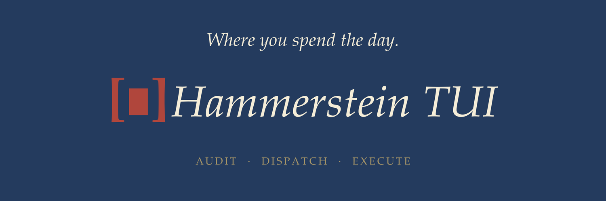

# Hammerstein TUI

A terminal-native TUI for strategic reasoning and code dispatch, built on the [Hammerstein framework](https://github.com/lerugray/hammerstein). Forked from [DeepSeek-TUI](https://github.com/Hmbown/DeepSeek-TUI) (MIT) and rebranded as the personal Claude Code substitute for the Hammerstein operator.

**Status:** Active fork. Native Rust binary with Hammerstein config paths, `hd` dispatch integration, Prussian theme default, sandbox-roots support for cross-repo writes, and rebranded display chrome / env vars (DEEPSEEK_* aliases retained for backward compat).

## What this is

Hammerstein TUI is the interactive layer of the Hammerstein stack:

| Layer | Tool | Role |
|---|---|---|
| Interactive | **Hammerstein TUI** (this) | Conversation, context, daily driver |
| Strategic | `hammerstein` CLI | Audit, scope, worth, next — pre-flight reasoning |
| Dispatch | `hd` | Routes to aider/DeepSeek/Claude for code execution |
| Execution | aider, Claude, etc. | File editing, git, the mechanical work |

The TUI is where you spend your day. `hd` dispatch runs from within it. The `hammerstein` CLI is called for audits before dispatch. Each layer stays independent.

## Quickstart

### One-line installer

```bash
curl -fsSL https://raw.githubusercontent.com/lerugray/hammerstein-tui/main/install.sh | bash
```

Then launch: `hamt`

### Manual setup

```bash
# Clone
git clone https://github.com/lerugray/hammerstein-tui.git
cd hammerstein-tui

# Install wrappers and slash command
ln -s "$(pwd)/scripts/hammerstein-tui" ~/.local/bin/hammerstein-tui
ln -s "$(pwd)/scripts/hammerstein-dispatch" ~/.local/bin/hammerstein-dispatch
mkdir -p ~/.deepseek/commands
ln -s "$(pwd)/scripts/commands/dispatch.md" ~/.deepseek/commands/dispatch.md

# Set your DeepSeek API key
export HAMMERSTEIN_API_KEY="sk-..."

# Launch
hammerstein-tui
```

## Dispatch from within the TUI

### Slash command (recommended)

Type `/dispatch fix the auth bug` in the TUI chat. The model:
1. Runs `hammerstein --template audit-this-plan` as a pre-flight
2. Shows the audit result
3. Confirms with you
4. Dispatches via `hd` for execution

Requires: `ln -s "$(pwd)/scripts/commands/dispatch.md" ~/.deepseek/commands/dispatch.md`

### Shell command (alternative)

Type `!hammerstein-dispatch "fix the auth bug"` to run audit + dispatch directly via shell.

## Config

Config lives at `~/.hammerstein/tui/config.toml` (separate from the Hammerstein CLI config at `~/.hammerstein/`).

Minimal config:

```toml
api_key = "sk-..."
default_text_model = "deepseek-v4-pro"
```

Or use env vars with the `HAMMERSTEIN_` prefix:

```bash
export HAMMERSTEIN_API_KEY="sk-..."
export HAMMERSTEIN_MODEL="deepseek-v4-pro"
```

Hamt reads `HAMMERSTEIN_*` natively and falls back to legacy `DEEPSEEK_*` aliases (logged as deprecated). The wrapper script also forwards a few `HAMMERSTEIN_*` env vars (api key, model, provider, base URL) to the legacy names for the case where you swap in an upstream `deepseek-tui` binary.

## Features

Everything from DeepSeek-TUI v0.8.16:

- Multi-provider support (DeepSeek, OpenAI, OpenRouter, Ollama, and more)
- Agentic mode with tool access (`--auto`)
- Non-interactive `exec` mode for scripting
- Git integration, session management, MCP support
- Code review, PR integration, patch application
- Custom slash commands, skills, and hooks

## Provider routing

Same as DeepSeek-TUI. Default provider is DeepSeek API. Override with:

```bash
hamt --provider openrouter
```

Or set `HAMMERSTEIN_PROVIDER=openrouter`.

## Relationship to DeepSeek-TUI

This is a fork of [DeepSeek-TUI](https://github.com/Hmbown/DeepSeek-TUI) (MIT license). The fork exists to:

1. Provide Hammerstein-branded launcher scripts with `HAMMERSTEIN_*` env vars
2. Integrate `hd` dispatch via slash command and shell script
3. Use `~/.hammerstein/tui/` for config (no conflict with deepseek-tui)
4. Eventually rebrand the Rust source fully

Upstream changes can be merged. The wrapper script approach means the fork works immediately without rebuilding the Rust binary.

## License

MIT (inherited from DeepSeek-TUI). See [LICENSE](LICENSE).
